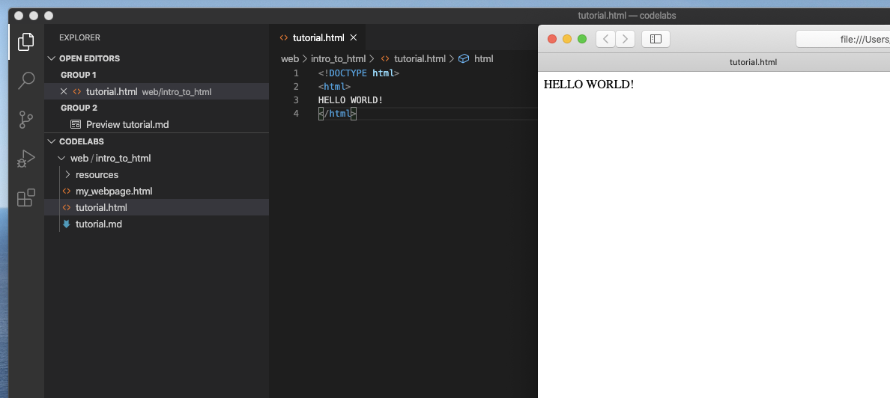

# Project Margaret Hamilton
## Introduction to HTML

Welcome to this introduction to HTML. Web pages have evolved a lot over the years and will often now be made up of lots of different kinds of components including HTML (HyperText Markup Language), JavaScript (JS), Cascading Style Sheets (CSS) and so on. In this tutorial, we'll make a basic web page with some HTML elements, apply some styling to them (with CSS) and then add a little script (in JS) to add a bit of interactivity to the page. But before we dig into this, let's have a quick look at how a webpage typically gets displayed on our screens.

1. A user enters the URL of the site they want to visit into the web browser.
2. The browser makes a request to the Domain Name Server to convert the URL into a physical Internet Protocol (IP) address.
3. With the IP address of the website host machine, or server, the browser can make a connection to the host and request the page. If the URL that the user enters includes a slug (a specific path made with forward slashes after the domain) then the host will return that specific page, otherwise, it will return whatever page is configured to be shown. For example, if a user were to enter bbc.co.uk/news then the server would know to return the news page instead of the main BBC home page.
4. As the file is received, the browser begins to render the contents. In modern pages, there will very often be lots of links to other files that the browser must also get while loading the page. For example, there will be images and maybe other media content that needs to be loaded. There will also be script files that will execute logic as part of the page load and in response to user interaction. There will also be files that contain data for the page to show (perhaps a user name if registered with the site) and so on.
5. Eventually, when all of the individual compoinents are loaded, all scripts executed, external data pulled in and there is nothing else left to do, the page is displayed and the user will begin to browse and interact with that page.

But let's not worry too much about all of those steps just yet!! In their least complicated form, websites are just files. In fact, you can load an html file from your local computer in your web browser. In this folder there should be a file called `tutorial.html`. Double click on that and it should open with your web browser. It's not much of a webpage just yet, in fact, all it does is ay "Hello World" but we have to start somewhere, so why not here? Let's go!


### Preparation and set up

While it is possible to write a perfectly functional website with something like notepad, it's not going to be easy, so we recommend installing an Integrated Development Editor (IDE) to make things easier for ourselves. (Some people say programmers are lazy and that we spend our time making things easy for ourselves. I'd disagree with them, but I can't be bothered...) Anyway, back to the setup. If you've already installed Visual Studio (VS) Code from a previous tutorial, then you can skip this (yay!) but if not, then head over to the [Visual Studio Code Download Page](https://code.visualstudio.com/Download) and then click on the download link for the operating system you're working on.

When that's downloaded, open the installer and follow the instructions to install the editor. By default, VS Code is all ready for wiritng HTML with some nice auto complete features to help with the names of tags and their associated attributes. (We'll explain what tags and attributes are later.)


### Making out web page

Let's begin by opening up VS Code and then from the File menu, select the option `Add Folder to Workspace...` browse to the folder `codelabs` and select to `Add` it. You should now see the contents of this folder listed in the project explorer. If the project explorer isn't open, the shortcut is `Cmd + Shift + E` on macOS or `Ctrl + Shift + E` on Windows. 

From the explorer, click on `tutorial.html` so that we can becgin to edit our webpage. In addition to opening the page in our editor, so that we can see our changes, we should also open in in a browser too. To do this, right click on the file's tab in VS Code and press on the option to `Copy Path`. Next, press ```Ctrl + ` ```to open the integrated terminal/command prompt. In there, enter the command `open ` and then paste the path to the web page. For example:

```
open /Users/admin/dev/codelabs/web/intro_to_html/tutorial.html
```

Now you should be able to see the webpage in raw HTML format in VS Code as well as its rendered state in the browser:



And now the real fun begins! Just to check everything is working, let's change where it says `HELLO WORLD` to say something else. In VS Code, replace the word `WORLD` with your name and save the file. Now select the web browser and reload the page (`Cmd + R` or `Ctrl + R`) and you should see that change you made to the HTML reflected in the rendered web page. 

Great! We've edited some HTML. Yes, it's not the biggest change ever, but now there is no stopping us! 

So. Remember we mentioned tags and attributes earlier? Well now is a good time to explain what they are. Tags are the fundamental parts of HTML that structure the document and tell the browser what to render on the page and how to arrange these components within the page. Some examples of tags include ``, `<button>` and `<div>`. Tags will often also support attributes. These are properties that can be applied to a tag that can customise how the component will behave. Sticking with our image tag, for example, we can use the property `src` to tell the image component where the image that it should show lives. 

```

```

Notice that slash before the closing bracket of the tag? All tags must be opened and closed so that the broweser knows where the tag starts and ends. Because in the example above, the image tag has no child tags or "inner HTML" we can use the shorthand for to signify open and close with just the one set of angular brackets. By contrast, you can see in our tutorial.html that our `html` tag is surrounding the text, as that text is a child of the html tag. In fact, the `html` tag is a special one, as it marks the root of the html document and so all components of the webpage will be nested within the `html` tag. Because of this, we need the separate opening and closing parts of the tag:

```
<html>
    ...
    Lots of child tags and text and other content
    ...
</html>
```

Note how we use the slash before the tag name to mark the closing of the tag.

There are also tags that can be used to format text within a page. For example, the tag `<b>` around some text will mark that as **bold**. In fact, let's give that a quick try; around the text that says hello to you, change the HTML to get the browser to show it in bold text. 

```
<b>HELLO AWESOME PERSON!</b>
```

Remember to save and then reload the webpage in the browser to see your changes. Of course, you might not always want to apply the same formatting to a whole piece of text and the good news is that you aren't forced to, either! When you have the whole text showing in bold text, experiment with the positioning of the `<b>` tag so that the web page shows just your name in bold, while leaving "HELLO" in normal text. 

**Wait!! What's that "DOCTYPE" tag and why doesn't that have a closing part?**
Good question - we're glad you asked! The `DOCTYPE` declaration is not actually a tag. It is however required in all html documents to tell the browser what content to expect. In the case of HTML, this becomes `<!DOCTYPE html>`.

The next tag we're going to look at is the `head` tag. This is typically found at the top of an html document and is used to provide metadata about the page. This might include references to other files that the browser will need to load as part of this page, or maybe things like where the favicon can be found, signalling the preferred size of a webpage and so on. For now though, we're just going to add a title to the page. Go ahead and add an opening and closing `head` tag in our document after the opening `html` tag but before the "HELLO..." text. Note that as we're going to be putting some child html elements within the `head`, it will need to have separate opening and closing tags, so we cannot use the shorthand example used for the `img` earlier in this tutorial. If you're using VS Code, you might notice that when you type the opening tag it automatically puts a closing tag. This is the beauty of IDEs that have autocomplete as it can help avoid typos, make sure you use the correct syntax and generally speed the development process up. OK, so within the `head` tags, we now want to add our title. Think of something creative to use as the title and then place it within the `title` tags you'll need to add. Again, the title text will be set as inner text of the `title` tag, so will need to be wrapped in opening and closing tags.

Refresh the page to see the title that you added. If you can't see the web page's title, you might need to open another tab so that the page's title shows up. The shortcut to do this in most browsers is `Cmd + T` on macOS or `Ctrl + T` on Windows.

```
<html>
    <head>
        <title>I'm using HTML</title>
    </head>
    HELLO <b>AWESOME PEERSON!</b>
</html>
```

Gives our webpage a cool title:


As you might be able to guess, after we've added our head to do any setup of the page, the place where the bulk of the page's content is called the `body`. Let's add a body to our document so that we can add some child elements to make our website a bit more exciting. We're not going to need the "HELLO..." text any more, so you can delete that and replace it with our opening and closing `body` tags. 

**Tip** - place the opening and closing tags on separate lines, as we will be adding 
child elements inside the `body` very soon.

HTML uses nesting of components to set up parent-child relationships. If we apply a style to something, that will also be applied to its children. So it's useful to have ways to group components. Right now, then, we want to make use of the `div` tag. Inside the div, we're going to put some paragraphs of text. Don't worry; we're not going to ask you to write an essay or anything (programmers are lazy, remember?) but we are going to see how we would format text into new lines and paragraphs. 

Copy the following code and place it between the `div` tags you added inside the `body`. Then save and reload the webpage to see what happens.

```
    This text is just going to be presented as-is.
    You can see here I have put this text on a new line, 
    but that will not be reflected in the browser.
    <p>However, you can see this text <b>will</b> appear on a new line.</p>
    <p>
        What if we want a new line but not a new paragraph?<br>
        We can use a line break <code>&ltbr&gt</code> tag for that. How handy!
    </p>
```

Let's review what happened here. The text at the top inside no tags gets rendered as plain text with no layout help at all. Notice how even though we have new lines in there, the browser does not make use of them? Sometimes it's nice and flexible to be able to have unformatted text in a webpage, but if we want to keep things tidy, we really have to tell the browser how we want things to look. 

Next we move onto the `p` tag, which marks a paragraph. This will add appropriate spacing to separate our paragraphs. It's a nice start, but still, if we had a really long load of text in that one paragraph, it would still just become a very long line of text, like we saw with the first batch of text. So how can we bring some order to this? That's where the `br` tag comes in. This tag marks a linebreak. You may have noticed it is a single tag and has neither the shorthand for closing or a specific closing tag. In some cases, like this one, where there is no need for open and closing parts of the tag, it is expected by the browser that the tag is a self-contained open-close and so we do not need to explicitly close it in code.

```
Before moving on, it is worth noting that there are lots of other ways of arranging our text, but they are beyond the scope of this lab.
```

Great! So we now have a page with a title and some random text. Let's add something a bit more imteresting, though. Well, everyone knows the Internet was made for cat pictures, but we prefer dogs, so let's add a picture of a dog to our website. :D This is one for you to try. Use the example from earlier in the tutorial to add an `img` tag to the web page and use `"resources/dog_1.jpg"` as the image's src location. Experiment with where you position the tag to see where it appears in the webpage.

```
HOW. CUTE. IS. THAT. DOG?!?
```

So, now for a quick pop-quiz:

```
Q: What's better than a dog?
A: MORE DOGS!
```

The page is now pretty amazing thanks to that one dog, but it could be many times better with even just one more dog picture. But... what if we allowed the user to decide when they want to see a new dog picture. And what if we made the picture selection random? Let's give that a try! We're going to add a button that when pressed, will replace the current picture with a different dog randomly selected from the various dog pictures availble. 


